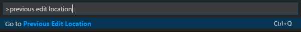
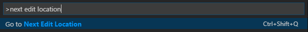
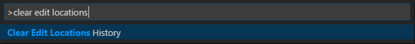

# edit-locations-history
Navigation through previous/next edit locations for Visual Studio Code

The following commands, shown below with their shortcuts, are available through the Command Palette:

## Changelog

[https://github.com/sadesyllas/edit-locations-history/blob/master/CHANGELOG.md](https://github.com/sadesyllas/edit-locations-history/blob/master/CHANGELOG.md)
